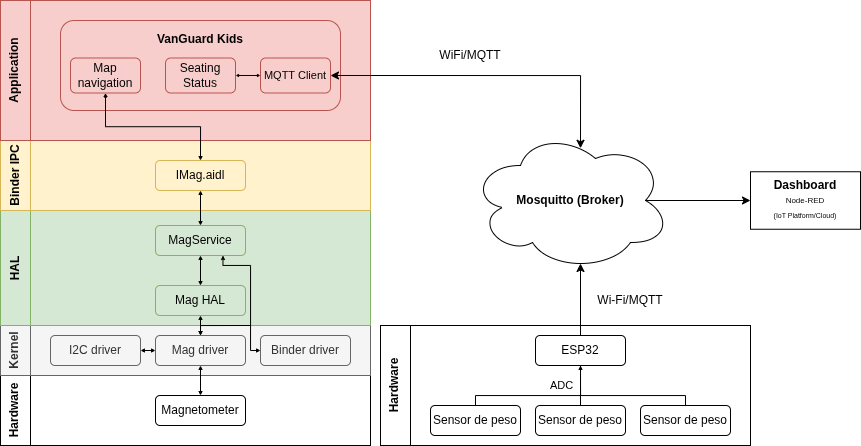

# VanGuard Kids

**Sistema IoT embarcado para monitoramento de ocupação e prevenção de esquecimento de crianças em veículos escolares.**

VanGuard Kids é um projeto desenvolvido como resultado de uma capacitação em **Android Embarcado** e **Internet das Coisas (IoT)**, realizada pelo [Instituto de Computação (IC)](https://www.ic.unicamp.br/) da Universidade Estadual de Campinas (UNICAMP), em parceria com o [Instituto de Pesquisas Eldorado](https://www.eldorado.org.br/).

## Visão geral

O **VanGuard Kids** é um sistema de monitoramento de assentos voltado para veículos de transporte escolar.

A proposta do projeto é auxiliar motoristas e responsáveis na identificação da presença de crianças no interior do veículo, especialmente ao final de uma rota. O sistema monitora os assentos por meio de sensores de pressão, exibe o estado de ocupação em um aplicativo Android embarcado e gera alertas visuais em situações de risco.

## Problema abordado

No transporte escolar, há risco de crianças serem esquecidas dentro do veículo após o encerramento da rota, especialmente quando estão dormindo, em assentos menos visíveis ou não são percebidas pelo motorista durante o desembarque.

Esse tipo de situação pode representar risco grave à segurança infantil. O VanGuard Kids atua como uma camada adicional de apoio ao motorista, fornecendo:

* monitoramento da ocupação dos assentos;
* visualização em tempo real do estado do veículo;
* alertas em caso de presença detectada após o fim da rota;
* registro e encaminhamento dos dados por meio de uma arquitetura IoT.

## Objetivo

Desenvolver um protótipo funcional de um sistema IoT embarcado capaz de:

* identificar assentos ocupados e livres;
* transmitir os dados dos sensores por MQTT;
* concentrar e visualizar os dados em um dashboard;
* exibir o estado dos assentos em uma aplicação Android;
* emitir alertas visuais em situações de risco;
* demonstrar a integração entre firmware, broker MQTT, Node-RED e Android embarcado.

## Arquitetura do sistema

O sistema é composto por quatro módulos principais:

1. **Firmware**
2. **Broker MQTT**
3. **Node-RED**
4. **Aplicativo Android**

A comunicação entre os módulos ocorre principalmente por meio do protocolo **MQTT**, utilizado para publicar e consumir os dados de ocupação dos assentos.

A Figura 1 apresenta a arquitetura geral do sistema, o papel de cada componente e o fluxo de comunicação entre eles.

<!-- markdownlint-disable MD033 -->

  
  
<em>Figura 1: Arquitetura do sistema</em>

<!-- markdownlint-enable MD033 -->

## Componentes

### Firmware

O firmware é responsável pela leitura dos sensores de pressão instalados nos assentos.

Principais responsabilidades:

* realizar a leitura dos sensores;
* identificar o estado de cada assento;
* montar as mensagens de ocupação;
* publicar os dados no broker MQTT.

Documentação específica: [Firmware](firmware/README.md)

### Broker MQTT

O broker MQTT atua como intermediário de comunicação entre os módulos do sistema.

Principais responsabilidades:

* receber mensagens publicadas pelo firmware;
* disponibilizar os dados para o Node-RED;
* disponibilizar os dados para o aplicativo Android;
* permitir comunicação assíncrona entre os componentes.

### Node-RED

O Node-RED é utilizado para concentrar, processar e visualizar os dados recebidos via MQTT.

Principais responsabilidades:

* consumir os tópicos MQTT publicados pelo firmware;
* organizar os dados de ocupação;
* montar dashboards de monitoramento;
* gerar alertas no fluxo visual;
* auxiliar na depuração e validação do sistema.

Documentação específica: [Node-RED](node-red/README.md)

### Aplicativo Android

O aplicativo Android é executado em uma Raspberry Pi 5B e atua como interface principal para o motorista.

Principais responsabilidades:

* receber os dados dos assentos via MQTT;
* exibir o estado de ocupação do veículo;
* indicar assentos livres e ocupados;
* emitir alerta visual em situação de risco;
* fornecer uma interface simples para acompanhamento da rota.

Documentação específica: [Aplicativo Android](android/README.md)

## Documentação dos módulos

Para detalhes de instalação, configuração e execução de cada parte do sistema, consulte os READMEs específicos:

* [Firmware](firmware/README.md)
* [Aplicativo Android](android/README.md)
* [Node-RED](node-red/README.md)

## Tecnologias utilizadas

* Android Embarcado
* Kotlin
* ESP32
* Potenciômetros (sensores de pressão simulados)
* Node-RED
* Raspberry Pi
* Mosquitto (Broker MQTT)
* Dashboard IoT
