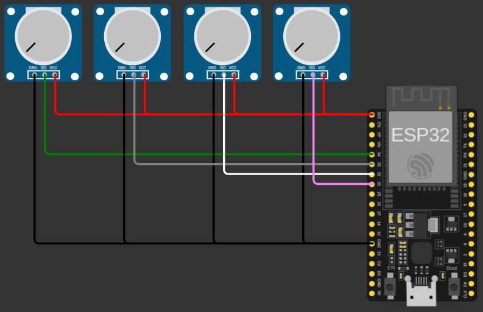
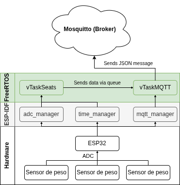
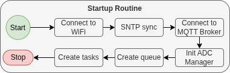
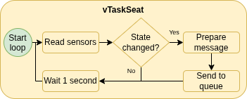
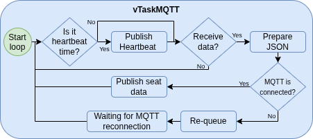
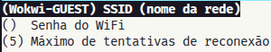
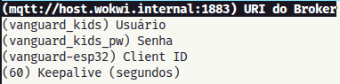
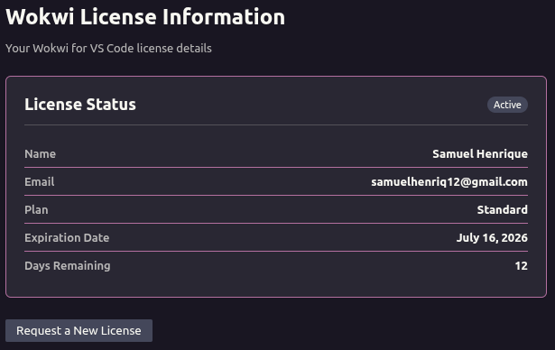

# Vanguard Kids - Firmware

Firmware ESP32 para o projeto Vanguard Kids. O sistema monitora quatro assentos usando entradas ADC e publica o estado via MQTT, além de enviar um heartbeat periódico.

## Pré-requisitos

- VS Code instalado
- ESP-IDF >= v5.0 e < v6.0: [Como instalar](https://docs.espressif.com/projects/esp-idf/en/latest/esp32/get-started/index.html)
- MQTT Broker: [Mosquitto](https://mosquitto.org/download/)
- Conta no simulador [Wokwi](https://wokwi.com/)
- Extensão [Wokwi Simulator](https://marketplace.visualstudio.com/items?itemName=Wokwi.wokwi-vscode) para VS Code
- Caso queira montar o circuito físico, você precisará de:
  - ESP32 DevKitC
  - 4 potenciômetros (10kΩ)
  - Protoboard e jumpers

## Circuito de prototipagem

O circuito de prototipagem conecta quatro potenciômetros aos canais ADC do ESP32, simulando os assentos. Cada potenciômetro representa um assento e varia a resistência para simular diferentes pesos. A tabela abaixo mostra o mapeamento dos potenciômetros para os GPIOs correspondentes:

<!-- markdownlint-disable MD033 -->
<div align="center">

  | Potenciômetro | Cor do fio | SIG |
  | :---: | :---: | :---: |
  | `1` | `VERDE` | GPIO34 |
  | `2` | `CINZA` | GPIO35 |
  | `3` | `BRANCO` | GPIO32 |
  | `4` | `ROSA` | GPIO33 |

</div>

<p align="center"><em>Tabela 1: Mapeamento dos assentos e canais ADC</em></p>
<!-- markdownlint-enable MD033 -->

A Figura 1 ilustra o circuito de prototipagem.

<!-- markdownlint-disable MD033 -->
<p align="center">

  

</p>

<p align="center"><em>Figura 1: Circuito de prototipagem</em></p>
<!-- markdownlint-enable MD033 -->

## Arquitetura

- `main/main.c`
  - `app_main()`: inicializa Wi-Fi, SNTP, MQTT e ADC.
  - Cria duas tarefas FreeRTOS:
    - `vTaskSeats`: lê ADC, converte para peso e detecta ocupação.
    - `vTaskMQTT`: publica eventos de assento e heartbeat no broker.
- `components/adc_manager`
  - Inicializa o ADC em modo one-shot.
  - Lê valores brutos e faz conversões para tensão e peso.
- `components/mqtt_manager`
  - Conecta ao broker MQTT.
  - Publica mensagens e aguarda reconexão.
- `components/mqtt_manager/wifi.c`
  - Configura Wi-Fi STA e reconecta automaticamente.
- `components/time_manager`
  - Inicializa SNTP e sincroniza o relógio.
  - Fornece timestamp epoch e string formatada.

A aplicação é baseada no ESP-IDF e utiliza FreeRTOS para multitarefa. O fluxo principal envolve a leitura periódica dos assentos, detecção de mudanças de estado e publicação de mensagens MQTT. A [Figura 1](docs/firmware_architecture.png) mostra a arquitetura do firmware, destacando os componentes principais e o fluxo de dados entre eles.

<!-- markdownlint-disable MD033 -->
<p align="center">
  
</p>

<p align="center"><em>Figura 2: Arquitetura do firmware</em></p>
<!-- markdownlint-enable MD033 -->

## Fluxo principal

1. `app_main()` inicializa:
   - NVS
   - Wi-Fi
   - SNTP
   - MQTT
   - ADC
2. `vTaskSeats` varre os 4 canais ADC periodicamente.
3. Quando há mudança de ocupação em um assento, a tarefa enfileira um `SeatMessage`.
4. `vTaskMQTT` consome a fila e publica os dados no MQTT.
5. A cada 30 segundos, um heartbeat é publicado.

### Fluxo de inicialização do firmware

O fluxo de inicialização detalhado é mostrado na [Figura 2](docs/startup_routine_flow.png). Ele ilustra a sequência de inicialização do sistema, incluindo a configuração de Wi-Fi, sincronização de tempo e estabelecimento da conexão MQTT.

<!-- markdownlint-disable MD033 -->
<p align="center">
  
</p>

<p align="center"><em>Figura 3: Fluxo de inicialização do firmware</em></p>
<!-- markdownlint-enable MD033 -->

### Fluxo de leitura dos assentos

O fluxo de leitura dos assentos é detalhado na [Figura 3](docs/vtaskseat_flow.png). A tarefa `vTaskSeats` realiza leituras periódicas dos canais ADC, converte os valores para peso e determina se cada assento está ocupado ou não. Quando há uma mudança de estado, a tarefa envia uma mensagem para a fila MQTT.

<!-- markdownlint-disable MD033 -->
<p align="center">
  
</p>

<p align="center"><em>Figura 4: Fluxo de leitura dos assentos</em></p>
<!-- markdownlint-enable MD033 -->

### Fluxo de publicação MQTT

O fluxo de publicação MQTT é detalhado na [Figura 4](docs/vtaskmqtt_flow.png). A tarefa `vTaskMQTT` consome mensagens da fila, publica os dados no broker MQTT e gerencia a reconexão em caso de falha. Além disso, a cada 30 segundos, um heartbeat é enviado para indicar que o sistema está ativo.

<!-- markdownlint-disable MD033 -->
<p align="center">
  
</p>

<p align="center"><em>Figura 5: Fluxo de publicação MQTT</em></p>
<!-- markdownlint-enable MD033 -->

## Mapeamento de assentos e hardware

A aplicação monitora 4 entradas ADC:

<!-- markdownlint-disable MD033 -->
<div align="center">

  | Assento | Canal ADC | GPIO |
  | --- | --- | --- |
  | `seat-01` | `ADC_CHANNEL_6` | GPIO34 |
  | `seat-02` | `ADC_CHANNEL_7` | GPIO35 |
  | `seat-03` | `ADC_CHANNEL_4` | GPIO32 |
  | `seat-04` | `ADC_CHANNEL_5` | GPIO33 |

</div>

<p align="center"><em>Tabela 2: Mapeamento dos assentos e canais ADC</em></p>
<!-- markdownlint-enable MD033 -->

Parâmetros importantes:

- `SEAT_COUNT = 4`: Quantidade de assentos monitorados.
- `MAX_WEIGHT_GRAMS = 50000.0f`: Peso máximo esperado em gramas.
- `OCCUPIED_THRESHOLD_G = 5000.0f`: Threshold de ocupação em gramas.
- `HEARTBEAT_INTERVAL_MS = 30000`: Intervalo de envio do heartbeat em milissegundos.

## TópicosMQTT e payloads

Tópicos usados:

- `vanguard-kids/seats/<seat-name>`
- `vanguard-kids/heartbeat`

Payload do heartbeat:

```json
{
  "client_id":"<client_id>",
  "ts":<epoch>,
  "seats":4
}
```

Payload do assento:

```json
{
  "client_id":"<client_id>",
  "seat":"seat-01",
  "adc_raw":1234,
  "voltage":1.22,
  "weight_g":1520,
  "occupied":true,
  "ts":1699999999
}
```

## Como executar

Garanta que você tenha o ESP-IDF instalado e configurado corretamente. Clone o repositório e navegue até a pasta do projeto:

```bash
git clone https://github.com/samuelhrqe/vanguard-kids.git
cd vanguard-kids/firmware
```

### 1. Defina o target do ESP32

```bash
idf.py set-target esp32
```

### 2. Configure o projeto

Acesse as configurações do projeto com o comando:

```bash
idf.py menuconfig
```

Navegue até o menu `Component config → VanGuard Kids — Configurações de Rede` e configure os parâmetros de Wi-Fi e MQTT conforme necessário.

#### 2.1 Configurações de Wi-Fi

Defina o SSID e a senha da rede Wi-Fi que o ESP32 deve se conectar. Se estiver usando o simulador Wokwi, mantenha os valores padrão.

<!-- markdownlint-disable MD033 -->
<p align="center">
  
</p>

<p align="center"><em>Figura 6: Configurações de Wi-Fi</em></p>
<!-- markdownlint-enable MD033 -->

#### 2.2 Configurações de MQTT

Para voltar ao menu principal, pressione `ESC` e selecione `MQTT`. Configure o URI do broker, nome de usuário, senha e client ID. Se estiver usando o simulador Wokwi, mantenha os valores padrão.

<!-- markdownlint-disable MD033 -->
<p align="center">
  
</p>

<p align="center"><em>Figura 7: Configurações de MQTT</em></p>
<!-- markdownlint-enable MD033 -->

Ao utilizar o simulador Wokwi, use o broker `mqtt://host.wokwi.internal:1883` para garantir a conectividade. Esse endereço permite que o Wokwi enxergue o `localhost` e se conecte ao Mosquitto local instalado no seu computador.

#### 2.3 Configuração do Mosquitto

Garanta que o Mosquitto esteja instalado e o serviço esteja rodando:

```bash
sudo systemctl status mosquitto
```

Para criar um usuário e senha para o Mosquitto, execute:

```bash
sudo mosquitto_passwd -c /etc/mosquitto/passwd <USER>
```

Ao executar o comando acima, você será solicitado a definir uma senha para o usuário especificado. Essa senha será usada para autenticação no broker MQTT. Após criar o usuário, reinicie o serviço do Mosquitto para aplicar as alterações:

```bash
sudo systemctl restart mosquitto
```

### 3. Build e deploy

Execute na raiz do projeto:

```bash
idf.py build
```

Caso queira testar o firmware em um ESP32 físico, conecte o dispositivo via USB e execute:

```bash
idf.py -p /dev/ttyUSB0 flash monitor
```

### 4. Simulação no Wokwi

Para executar a simulação no Wokwi, é necessário requisitar uma licença gratuita por 30 dias. Comm a extensão Wokwi Simulator instalada:

1. Combine as teclas `Ctrl+Shift+P`
2. Pesquise por "Wokwi: Request Free Trial License" e selecione com `ENTER`
3. O VS Code perguntará se você deseja abrir o site, confirme a ação
4. No site do Wokwi, clique em "GET YOUR LICENSE". Logue na sua conta ou crie uma.
5. Confirme a solicitação da licença gratuita ou copie o código da licença e cole no VS Code quando solicitado.
6. Na barra inferior do VS Code, você verá a mensagem: "License activated for [your name]"

Para confirmar que a licença foi ativada:

1. Combine as teclas `Ctrl+Shift+P`
2. Pesquise por "Wokwi: Show License Info" e selecione com `ENTER`
3. O VS Code exibirá as informações da licença, incluindo a data de expiração como na Figura 8.

<!-- markdownlint-disable MD033 -->
<p align="center">
  
</p>

<p align="center"><em>Figura 8: Informações sobre a licença</em></p>
<!-- markdownlint-enable MD033 -->

Em seguida, abra o arquivo [diagram.json](./diagram.json) no VS Code com a extensão Wokwi e clique em "Start Simulation" para iniciar a simulação. O firmware será carregado no ESP32 virtual e começará a publicar mensagens MQTT conforme configurado.
