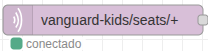
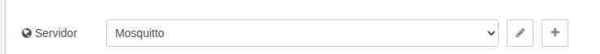
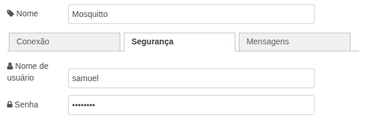
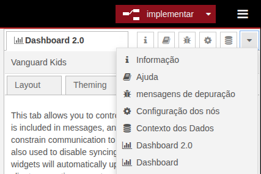
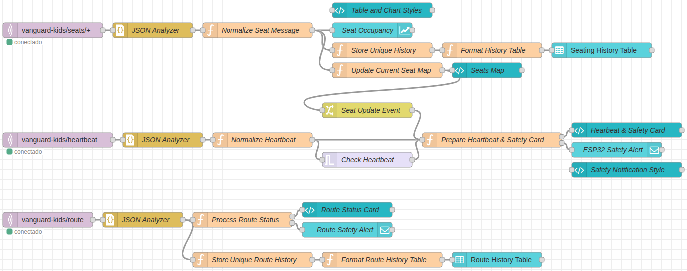

# Node-RED - Plataforma IoT

Node-RED é uma ferramenta de programação visual que permite a criação de fluxos de dados para IoT e automação. Baseado em Node.js, ele fornece uma interface de arrastar e soltar para conectar nós. Ele foi escolhido para este projeto devido à sua flexibilidade, facilidade de uso e experiência de uso anterior com a plataforma.

## Instalação

O Node-RED pode ser instalado de várias maneiras. Para esse projeto, o Node-RED foi instalado localmente.

### Pré-requisitos

- Node.js ([Supported Node versions](https://nodered.org/docs/faq/node-versions)).
  - Para instalação do Node.js, foi utilizado o [NVM](https://github.com/nvm-sh/nvm/blob/master/README.md). O link acima fornece instruções detalhadas para instalação do NVM e do Node.js.

Após a instalação do Node.js, o Node-RED pode ser instalado globalmente usando o npm:

```bash
sudo npm install -g node-red
```

Mais informações sobre a instalação do Node-RED podem ser encontradas na [documentação oficial](https://nodered.org/docs/getting-started/local).

## Iniciando o Node-RED

O fluxo criado para esse projeto está disponível em `flow.json`. Para iniciá-lo, execute o seguinte comando no terminal:

```bash
node-red flow.json
```

Após a execução do comando, o Node-RED estará disponível no navegador através do endereço [http://localhost:1880](http://localhost:1880). A interface de usuário do Node-RED permite a criação e edição de fluxos de dados de forma intuitiva.

## Configurando o fluxo

Para que os dados vindos do MQTT Broker sejam recebidos é necessário configurar a conexão com o Broker.

### Conexão com o MQTT Broker

1. Abra o Node-RED no navegador, procure o nó "mqtt_in" como mostrado na Figura 1 e clique duas vezes para abrir suas configurações.
<!-- markdownlint-disable MD029 -->
<!-- markdownlint-disable MD033 -->
<div align="center">
  
  <p align="center"><em>Figura 1: Nó de entrada MQTT</em></p>
</div>
<!-- markdownlint-enable MD033 -->

2. Na janela de configuração do nó, edite o campo "Servidor" e clique no botão de lápis para editar a conexão com o Broker.

<!-- markdownlint-disable MD033 -->
<div align="center">
  
  <p align="center"><em>Figura 2: Campo de servidor MQTT</em></p>
</div>
<!-- markdownlint-enable MD033 -->

3. Na aba de "Conexão", insira o endereço do Broker e porta

    Porta utilizada: 1883. Endereço do Broker: `mqtt://localhost:1883` (ou o endereço IP do dispositivo que está executando o Mosquitto).

4. Na aba "Segurança", preencha nome de usuário e senha conforme configurado no Mosquitto.

    <!-- markdownlint-disable MD033 -->
    <div align="center">
    
    <p align="center"><em>Figura 3: Campo de servidor MQTT</em></p>
    </div>
    <!-- markdownlint-enable MD033 -->

    Insira o usuário e a senha configurados no Mosquitto para autenticação. Mais detalhes sobre a
    configuração do Mosquitto podem ser encontrados na seção "Configurações de MQTT" no [README.md](../
    firmware/README.md).

Clique em "Atualizar" para salvar as alterações e depois em "Implementar" no canto superior direito da tela para aplicar as mudanças no fluxo.

### Instalação do Dashboard 2

O Node-RED Dashboard 2 é um conjunto de nós que permite criar interfaces gráficas para visualização e controle de dados em tempo real. Para instalar o Dashboard 2, siga os passos abaixo:

1. Abra o Node-RED no navegador e clique no menu no canto superior direito (três linhas horizontais).
2. Selecione "Gerenciar paleta" no menu suspenso.
3. Na aba "Instalar", pesquise por "node-red-dashboard-2-user-addon" e clique em "Instalar" para adicionar o Dashboard 2 ao Node-RED.

    Você também pode instalar o Dashboard 2 via terminal com o seguinte comando:

    ```bash
    npm install @flowfuse/node-red-dashboard-2-user-addon
    ```

4. Após a instalação, reinicie o Node-RED para que as alterações entrem em vigor.
5. Para abrir o Dashboard, procure por "Dashboard 2.0" no canto superior direito, como na Figura 4.

    <!-- markdownlint-disable MD033 -->
    <div align="center">
    
    <p align="center"><em>Figura 4: Abertura do Dashboard 2.0</em></p>
    </div>
    <!-- markdownlint-enable MD033 -->

    Ao selecionar o Dashboard 2.0, clique em "Open Dashboard". Uma nova aba será aberta no navegador com o dashboard. Você também pode abrir diretamente o link [http://127.0.0.1:1880/dashboard/seats](http://127.0.0.1:1880/dashboard/seats) para acessar o dashboard.

## Fluxo e nós utilizados

O fluxo no Node-RED foi montado de acordo com a Figura 5.

<!-- markdownlint-disable MD033 -->
<div align="center">

<p align="center"><em>Figura 5: Fluxo e nós utilizados</em></p>
</div>

O fluxo é composto por diversos nós, cada um com uma função específica. A tabela abaixo descreve cada nó utilizado no fluxo, incluindo seu nome, tipo e uma breve descrição de sua função.

<div align="center">

  | Nome | Tipo | Descrição |
  | --- | --- | --- |
  | `vanguard-kids/seats/+` | `MQTT Input` | Subscrição ao tópico de assentos |
  | `vanguard-kids/heartbeat` | `MQTT Input` | Subscrição ao tópico de heartbeat |
  | `vanguard-kids/route` | `MQTT Input` | Subscrição ao tópico de rota |
  | `Normalize Seat Message` | `Função JS` | Converte timestamp em data, hora, millisegundos e monta a mensagem para o próximo nó. |
  | `Seat Occupancy` | `UI Chart` | Plotagem de gráficos de ocupação dos assentos. |
  | `Store Unique History` | `Função JS` | Armazena em contexto informações sobre os assentos. |
  | `Format History Table` | `Função JS` | Formata os dados para a tabela de histórico. |
  | `Seating History Table` | `UI Table` | Tabela de histórico de assentos. |
  | `Update Current Seat Map` | `Função JS` | Atualiza o mapa de assentos. |
  | `Seats Map` | `UI Template` | Mapa de assentos. |
  | `Seat Update Event` | `Change Node` | Gera evento quando há atualização em um assento. |
  | `Normalize Heartbeat` | `Função JS` | Formata a mensagem de heartbeat. |
  | `Check Heartbeat` | `Trigger` | Monitora o recebimento de mensagens de heartbeat. |
  | `Prepare Heartbeat & Safety Card` | `Função JS` | Prepara as informações para o card de heartbeat e notificação com mensagem de alerta. |
  | `Heartbeat & Safety Card` | `UI Template` | Card de heartbeat. |
  | `ESP32 Safety Alert` | `Notification` | Dispara notificação com mensagem de alerta. |
  | `Process Route Status` | `Função JS` | Processa a mensagem de status da rota. |
  | `Route Status Card` | `UI Template` | Card de status da rota. |
  | `Route Safety Alert` | `Notification` | Dispara notificação com mensagem de alerta. |
  | `Store Unique Route History` | `Função JS` | Armazena em contexto informações sobre as rotas. |
  | `Format Route History Table` | `Função JS` | Formata os dados para a tabela de histórico de rotas. |
  | `Route History Table` | `UI Table` | Tabela de histórico de rotas. |
  | `Table and Chart Style` | `UI Template` | Classe CSS para tabela e gráfico. |
  | `Safety Notification Style` | `UI Template` | Classe CSS para notificações. |

</div>

<p align="center"><em>Tabela 1: Descrição dos nós utilizados</em></p>

<!-- markdownlint-enable MD033 -->